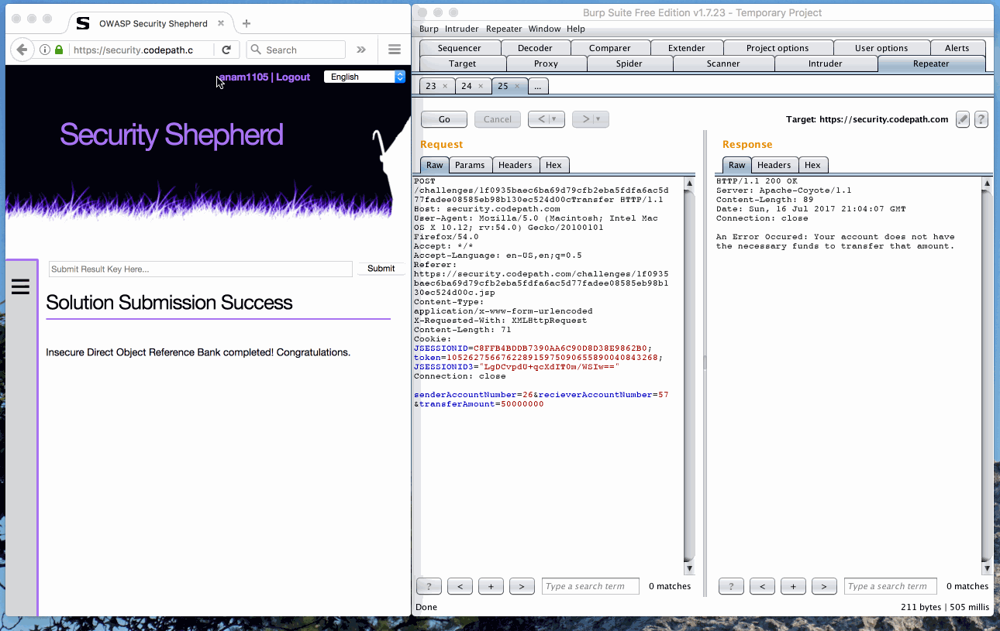

#Cybersecurity Pre-Work - *anam1105* 

## Description

This is my (Ana Malhotra's) submission of the Cybersecurity Pre-Work.

It includes:
* Completed functionality information
* Video walkthrough, featuring:
-* Username on Security Shepard
-* Completed challenges on Security Shepard
-* Usage of Burp
* Notes on challenges encountered
* Installation instructions and additional tips
* License information

Time spent: **3** hours spent in total 

## User Stories

The following **required** functionality is completed:

1. [x]  Required: Setup 
    -  [x]  Download and install Burp
    -  [x]  Configure your browser to direct traffic through Burp
    -  [x]  Can successfully view HTTPS traffic in sa
    -  [x]  Register an account at security.shephard.com
  
2. [x]  Required: Challenge 1 - HTTP Headers
3. [x]  Required: Challenge 2 - Basic Routes 1
4. [x]  Required: Challenge 3 - Query Params 1
5. [x]  Required: Challenge 4 - Insecure Direct Object References (IDOR)
6. [x]  Required: Challenge 5 - IDOR Challenge 1 

The following advanced user stories are optional:

* [x]  Bonus 1: IDOR Challenge 2 
* [x]  Bonus 2: IDOR Bank Challenge 3

## Video Walkthrough

Here's a walkthrough of implemented user stories:

GIF created with [LiceCap](http://www.cockos.com/licecap/).

## Notes

Setup seemed to be the most difficult part of the pre-work. The issue seemed to be most derived from the fact that I was using Safari on macOS and the fact that I'm currently in New Zealand, so some unexpected network blockages were happening.

There seemed to be some inconsistencies in the hints/instructions for the challenges. For example, the Challenge 2 CodePath instructions stated "...figure out which *URL* is being used..." where as the Security Shepard instructions asked for *URI* and the linked Quora thread used the term *UFI*. The different terms threw me off a bit.

## Installation Instructions

Installation and setup of Pre-Work was done by following [these instructions](https://courses.codepath.com/snippets/cyber_security_university/prework).

Some additional notes to take into consideration when working on macOS:
* If running into issues regarding slow page loads when the proxy is enabled, try using a different browser such as Chrome or Firefox.
* If using Safari and unable to authorize Burp's CA Certificate, try using the Keychain Access utility app to single out the certificate and authorize.

Some additional notes when using Burp:
*When adding Facebook URLs to scope, make sure not to add a specific URL. Make sure all Facebook URLs are in scope. 

## License

    Copyright [2017] [Ana Malhotra]

    Licensed under the Apache License, Version 2.0 (the "License");
    you may not use this file except in compliance with the License.
    You may obtain a copy of the License at

        http://www.apache.org/licenses/LICENSE-2.0

    Unless required by applicable law or agreed to in writing, software
    distributed under the License is distributed on an "AS IS" BASIS,
    WITHOUT WARRANTIES OR CONDITIONS OF ANY KIND, either express or implied.
    See the License for the specific language governing permissions and
    limitations under the License.
